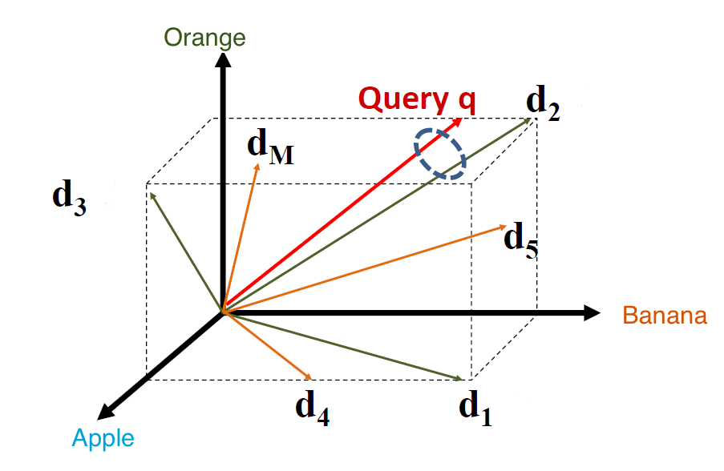
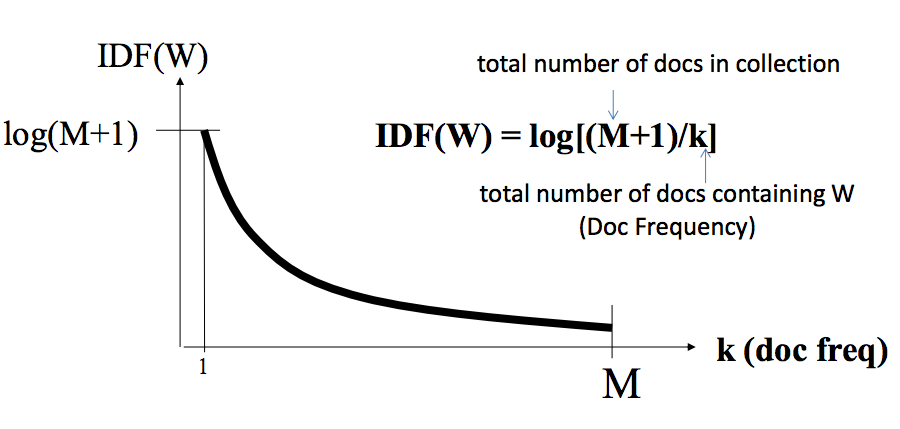
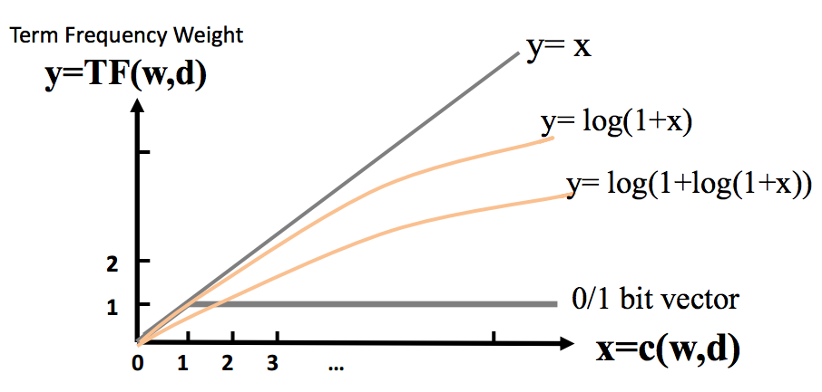

# Introduction to Text Mining and Natural Language Processing in Python

## Part 1: Text Processing with NLTK and Vector Space Models 

**Github Repo: <https://github.com/rmanak/nlp_tutorials>**

This tutorial is an overview of available tools in python for text mining
and natural language processing. I will also briefly mention recent advances in 
applications of deep learning in NLP, particularly word embedding.

At the end of this post, there is a tutorial on sentiment analysis of IMDB reviews. It will demonstrate the
applications of all the material we discuss here in an end-to-end machine learning pipeline fashion.
The sentiment analysis example will have about 96% AUC score [[1](https://en.wikipedia.org/wiki/Receiver_operating_characteristic), [2](http://scikit-learn.org/stable/modules/generated/sklearn.metrics.roc_auc_score.html)], and you should be able to upload the results
to this Kaggle competition <https://www.kaggle.com/c/word2vec-nlp-tutorial/> to evaluate it.

You may directly jump to the Ipython notebook of the sentiment analysis, if you are familiar with the
basics of text processing and vector space models. 

The notebook is here ->> [popcorn.ipynb](https://github.com/rmanak/nlp_tutorials/blob/master/popcorn.ipynb)

All of the codes in this post are in [this github repo.](https://github.com/rmanak/nlp_tutorials/)

I also try to link to some amazing free online resources to learn NLP along this post.

### Vector space representation of documents

A very simple approach to represent documents as numerical value is to use each word 
as an *atomic* type and as a basis for a vector space:



For example imagine a world where there exist only 3 words: "Apple", "Orange", and "Banana" and every
sentence or document is made of them. They become the basis of a 3 dimensional vector space:

```
Apple  ==>> [1,0,0]
Banana ==>> [0,1,0]
Orange ==>> [0,0,1]
```

Then a *"sentence"* or a *"document"* is simply the linear combination of these vectors where the number of
the counts of appearance of the words is the coefficient along that dimension.
For example in the image above:

```
d3 = "Apple Orange Orange Apple" ==>> [2,0,2]
d4 = "Apple Banana Apple Banana" ==>> [2,2,0]
d1 = "Banana Apple Banana Banana Banana Apple" ==>> [2,4,0]
d2 = "Banana Orange Banana Banana Orange Banana" ==>> [0,4,2]
d5 = "Banana Apple Banana Banana Orange Banana" ==>> [1,4,1]
```

Now the similarity of the documents, or a query to a document can be measured by the similarity of these
vectors (for example cosine similarity).

This vectorization is implemented in [scikit-learn's CountVectorizer](http://scikit-learn.org/stable/modules/generated/sklearn.feature_extraction.text.CountVectorizer.html)

```python
corpus = ["Apple Orange Orange Apple",\
          "Apple Banana Apple Banana",\
          "Banana Apple Banana Banana Banana Apple",\
          "Banana Orange Banana Banana Orange Banana",\
          "Banana Apple Banana Banana Orange Banana"]
          
from sklearn.feature_extraction.text import CountVectorizer

vectorizer = CountVectorizer()

vectorizer.fit(corpus)

corpus_vec = vectorizer.transform(corpus).toarray()

print(corpus_vec)
```

And we get:

```
[[2 0 2]
 [2 2 0]
 [2 4 0]
 [0 4 2]
 [1 4 1]]
```

**Notice that in this model documents/sentences lose their order and syntactic structure!**

#### The problems with this VSM

There are several issues with this approach when you consider the entire English dictionary. For example:

1. There are words that are just very common, so they appear in lots of documents. ("the", "and", "or" etc..)
2. In a given document we shouldn't count repeating words too much.
3. When words are used as atomic types for the basis of the vector space, they have no semantic relations 
(the similarity between them is zero, since they are perpendicular to each other). However, in reality
we know that words can be similar in meaning, or even almost identical synonyms. 
4. And of course syntactic structure is completely lost.

#### Solution to 1 and 2: TF-IDF

Term Frequency Inverse Document Frequency (TF-IDF) is a very good solution for the problems 1 and 2 above.

#### IDF: (Inverse document frequency)
The idea is to penalize the total count of a word in a document 
by the number of its appearance in all of the documents. The higher this number
the less valuable the word is -- it contains less information that can identify the document.
In the extreme case, where the word appears in large fraction of the documents, usually it is even better to completely eliminate the count.
This is known as *stopwords*, or *corpus specific stopwords*.

A good heuristic is **``log((1+M)/k)``** where **``M``** is the number of the documents and **``k``** is the number 
of the documents that the word appears in. See the following diagram from 
[Text Retrieval and Search Engines course on Coursera](https://www.coursera.org/learn/text-retrieval/)



#### TF: Term frequency
Another problem is how many times shall we count a word in a document? Two extremes are to count them as many time as they appear,
or just count them once and ignore the other appearance of the word. As you can guess something in between is a good solution! 
The nonlinear transformation of this count is called **``TF``** function, there are many heuristics for it, one known to work very well
with search engines is [BM25](https://en.wikipedia.org/wiki/Okapi_BM25).
Take a look at the following diagram from [TRSE Coursera lectures](https://www.coursera.org/learn/text-retrieval/)


#### TF-IDF Example:
This algorithm is implemented in [scikit-learn's TfidfVectorizer](http://scikit-learn.org/stable/modules/generated/sklearn.feature_extraction.text.TfidfVectorizer.html):

```python
from sklearn.feature_extraction.text import TfidfVectorizer

vectorizer = TfidfVectorizer()

vectorizer.fit(corpus)

corpus_vec = vectorizer.transform(corpus).toarray()

print(corpus_vec)
```

and we get:

```
[[ 0.64374446  0.          0.76524053]
 [ 0.70710678  0.70710678  0.        ]
 [ 0.4472136   0.89442719  0.        ]
 [ 0.          0.85962194  0.51093065]
 [ 0.23304334  0.93217336  0.2770264 ]]
```


*Note:* Both count vectorizer and tf-idf vectorizer are very smart with their memory management, and save the returned matrix in SciPy sparse matrix.
When ``.toarray()`` is performed they return the actual matrix which can be too large to keep in memory!

### How to prepare the text?

There are still several issues that we ignored in the examples above including:

1. Words can have different versions: "car", "cars", "apply", "applied" etc...
2. How to split the sentence to a list of words?
3. What about the words that are incredibly common in English and have almost no meaning (no information)? 
For example "the" "that" etc...

#### Stemming

Stemming is the process of finding the root of the word, ``nltk`` provides 3 different version of stemmers: 
``porter``, ``snowball`` and ``wordnetlemmatizer``

Let's first wrap them all into a single class:

```python
import nltk.stem
from nltk.stem import WordNetLemmatizer

class WordNetStemmer(WordNetLemmatizer):
    def stem(self,word,pos=u'n'):
        return self.lemmatize(word,pos)

class Stemmer(object):
    def __init__(self,stemmer_type):
        self.stemmer_type = stemmer_type
        if (self.stemmer_type == 'porter'):
            self.stemmer = nltk.stem.PorterStemmer()
        elif (self.stemmer_type == 'snowball'):
            self.stemmer = nltk.stem.SnowballStemmer('english')
        elif (self.stemmer_type == 'lemmatize'):
            self.stemmer = WordNetStemmer()
        else:
            raise NameError("'"+stemmer_type +"'" + " not supported")
```

Now we can define 3 different stemmer objects:

```python
stemmer1 = Stemmer('porter').stemmer
stemmer2 = Stemmer('snowball').stemmer
stemmer3 = Stemmer('lemmatize').stemmer
```

And their performance is shown below: 

```python
some_words=['applied', 'cars', 'written', 'done', 'painting']
print("Original:", some_words)

stemmed = [stemmer1.stem(w) for w in some_words]
print("Stemmed with porter:", stemmed)

stemmed = [stemmer2.stem(w) for w in some_words]
print("Stemmed with snowball:",stemmed)

stemmed = [stemmer3.stem(w,'v') for w in some_words]
print("Stemmed with lemmatize:",stemmed)
```

Output:

```
Original: ['applied', 'cars', 'written', 'done', 'painting']
Stemmed with porter: ['appli', 'car', 'written', 'done', 'paint']
Stemmed with snowball: ['appli', 'car', 'written', 'done', 'paint']
Stemmed with lemmatize: ['apply', 'cars', 'write', 'do', 'paint']
```

*Note*: Technically lemmatization is not the same as stemming and as you can see, the lemmatizer needs the POS(part of speech) of the word, 'v' (for verb), to work, 
and even though it is much slower than the others, it returns an actual english word. See [this article about stemming and lemmatization](http://nlp.stanford.edu/IR-book/html/htmledition/stemming-and-lemmatization-1.html)
                                       
#### Tokenization (splitting the document to words)

There are several ways to split sentences and document to words, one is simply to use the white space character!

* **White space**: (easiest and fastest approach) 

```python
print('This is a sentence.'.split())
```
Output:

```
['This', 'is', 'a', 'sentence.']
```

(You can already see the problem with the '.' at the end of "sentence.".

* **using regexp**: (better for complicated combination of characters)

For example consider the following text -- from a wonderful book: [Natural Language Processing in Python](http://www.nltk.org/book/)

```python
raw = """'When I'M a Duchess,' she said to herself, (not in a very hopeful tone
though), 'I won't have any pepper in my kitchen AT ALL. Soup does very
well without--Maybe it's ! 12$ 82% always pepper $10.2 U.S.A. that makes 
people hot-tempered,'..."""
```

There are several issues for example what to do with "hot-tempered" or "82%" or "U.S.A".

Let's try the white space using python's regexp package: ``re``

```python
import re

print(re.split(r' ', raw))
```

Output:

```
["'When", "I'M", 'a', "Duchess,'", 'she', 'said', 'to', 'herself,', '(not',
'in', 'a', 'very', 'hopeful', 'tone\nthough),', "'I", "won't", 'have', 'any',
'pepper', 'in', 'my', 'kitchen', 'AT', 'ALL.', 'Soup', 'does', 'very\nwell',
'without--Maybe', "it's", '!', '12$', '82%', 'always', 'pepper', '$10.2', 'U.S.A.',
'that', 'makes', '\npeople', "hot-tempered,'..."]
```

We can split by word boundaries:

```python
print(re.split(r'\W+', raw))
```

Output:

```
['', 'When', 'I', 'M', 'a', 'Duchess', 'she', 'said', 'to', 'herself', 'not', 'in', 'a',
'very', 'hopeful', 'tone', 'though', 'I', 'won', 't', 'have', 'any', 'pepper', 'in', 'my', 
'kitchen', 'AT', 'ALL', 'Soup', 'does', 'very', 'well', 'without', 'Maybe', 'it', 's', '12',
'82', 'always', 'pepper', '10', '2', 'U', 'S', 'A', 'that', 'makes', 'people', 'hot', 'tempered', '']
```

Let's try sklearn's default tokenizer pattern:

```python
print(re.findall(r"\b\w\w+\b",raw))
```

Output:

```
['When', 'Duchess', 'she', 'said', 'to', 'herself', 'not', 'in', 'very', 'hopeful', 'tone',
'though', 'won', 'have', 'any', 'pepper', 'in', 'my', 'kitchen', 'AT', 'ALL', 'Soup',
'does', 'very', 'well', 'without', 'Maybe', 'it', '12', '82', 'always', 'pepper', '10',
'that', 'makes', 'people', 'hot', 'tempered']
```

Or we can try a fairly complicated pattern that can capture 
all sort of non-alphabetical characters attached to the words:

```python
print(re.findall(r"(?:[A-Z]\.)+|\w+(?:[']\w+)*|\$?\d+(?:\.\d+)?%?", raw))
```

Output:

```
['When', "I'M", 'a', 'Duchess', 'she', 'said', 'to', 'herself', 'not', 'in', 'a',
'very', 'hopeful', 'tone', 'though', 'I', "won't", 'have', 'any', 'pepper', 'in',
'my', 'kitchen', 'AT', 'ALL', 'Soup', 'does', 'very', 'well', 'without', 'Maybe',
"it's", '12', '82', 'always', 'pepper', '$10.2', 'U.S.A.', 'that', 'makes', 'people',
'hot', 'tempered']
```

For an extended discussion about text processing see [Chapter 3 of NLTK book](http://www.nltk.org/book/ch03.html)

#### Highly frequent words (stopwords)

Here they are in NLTK library:

```python
from nltk.corpus import stopwords

print(stopwords.words('english'))
```

Output:

```
['i', 'me', 'my', 'myself', 'we', 'our', 'ours', 'ourselves', 'you', 'your',
'yours', 'yourself', 'yourselves', 'he', 'him', 'his', 'himself', 'she', 'her',
'hers', 'herself', 'it', 'its', 'itself', 'they', 'them', 'their', 'theirs',
'themselves', 'what', 'which', 'who', 'whom', 'this', 'that', 'these', 'those',
'am', 'is', 'are', 'was', 'were', 'be', 'been', 'being', 'have', 'has', 'had',
'having', 'do', 'does', 'did', 'doing', 'a', 'an', 'the', 'and', 'but', 'if',
'or', 'because', 'as', 'until', 'while', 'of', 'at', 'by', 'for', 'with', 'about',
'against', 'between', 'into', 'through', 'during', 'before', 'after', 'above',
'below', 'to', 'from', 'up', 'down', 'in', 'out', 'on', 'off', 'over', 'under',
'again', 'further', 'then', 'once', 'here', 'there', 'when', 'where', 'why', 'how',
'all', 'any', 'both', 'each', 'few', 'more', 'most', 'other', 'some', 'such', 'no',
'nor', 'not', 'only', 'own', 'same', 'so', 'than', 'too', 'very', 's', 't', 'can',
'will', 'just', 'don', 'should', 'now', 'd', 'll', 'm', 'o', 're', 've', 'y', 'ain',
'aren', 'couldn', 'didn', 'doesn', 'hadn', 'hasn', 'haven', 'isn', 'ma', 'mightn'
, 'mustn', 'needn', 'shan', 'shouldn', 'wasn', 'weren', 'won', 'wouldn']
```

And of course if lowercasing the alphabet in the words doesn't change its meaning, it should be done, since "ORANGE" and "orange" are the same
until they are not! (Apple as a name of a corporation, "US" as name of a country etc..)

#### Wordnet
Wordnet is a large lexical database that groups English words and can be used to find relations between them. Simply it can used as a dictionary:

```python
from nltk.corpus import wordnet as wn

print("Category name:", wn.synsets('motorcar'))

print("Synonyms:", wn.synset('car.n.01').lemma_names())

print("Definition:", wn.synset('car.n.01').definition())

print("Example:", wn.synset('car.n.01').examples())
```

Output:

```
Category name: [Synset('car.n.01')]

Synonyms: ['car', 'auto', 'automobile', 'machine', 'motorcar']

Definition: a motor vehicle with four wheels; usually propelled by an internal combustion engine

Example: ['he needs a car to get to work']
```

*Note*: Words can belong to different category. Another simpler python dictionary API is [PyDictionary](https://pypi.python.org/pypi/PyDictionary/1.3.4)

#### Capturing surrounding words

One way to capture some of the locality features from text is to use n-grams (n > 1). n-grams are basically
imaginary words that are made of a window of n words:

```
Apple Apple Banana Orange  (bigrams) ===>>> [Apple_Apple , Apple_Banana , Banana_Orange]
                           (trigrams) ====>>> [Apple_Apple_Banana , Apple_Banana_Orange] 
                           (4 grams) ===> only one: the entire string!
```

Here is an implementation from Chenglong Chen's github [[+]](https://github.com/ChenglongChen/Kaggle_CrowdFlower/blob/master/Code/Feat/ngram.py):

*Note*: The number of unique n-grams grows rapidly with the size of the 
corpus and going beyond 3-grams is quite hard on a standard PC with ~ 10 GB RAM.

*Note2*: n-grams are implemented in sklearn's' [TF-IDF vectorizer](http://scikit-learn.org/stable/modules/generated/sklearn.feature_extraction.text.TfidfVectorizer.html)

