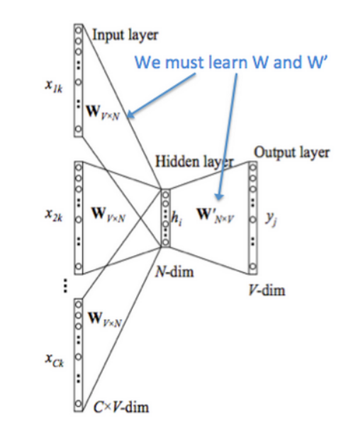
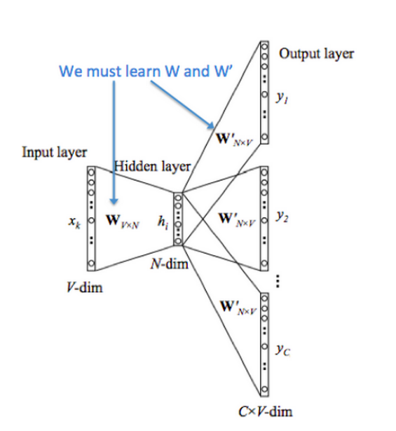
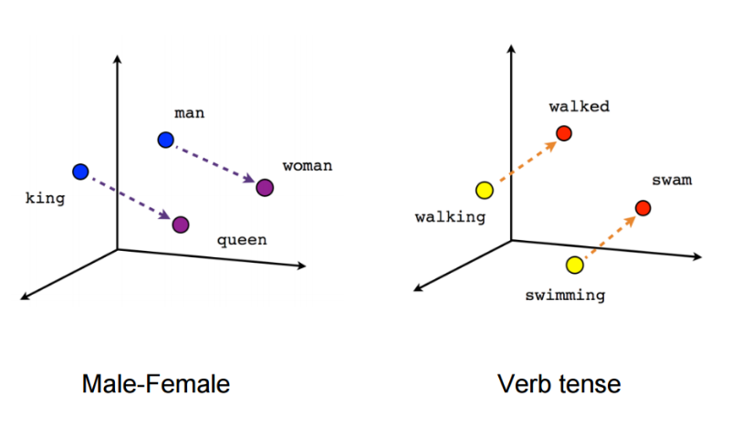

# Intro to Text Mining and Natural Language Processing in Python

**Github Repo: <https://github.com/rmanak/nlp_tutorials>**

This tutorial is an overview of available tools in python for text mining
and natural language processing. We will also go through some recent technologies
such as deep learning in NLP and word embedding. 

## Vector space representation of documents

A very simple approach is to use each word as an *atomic* type and as a a basis for a vector space:


For example imagine a world where there exist only 3 words: "Apple", "Orange", and "Banana" and every
sentence or document is made of them. They become the basis of a 3 dimensional vector space:

```
Apple  ==>> [1,0,0]
Banana ==>> [0,1,0]
Orange ==>> [0,0,1]
```

Then a *"sentence"* or a *"document"* becomes the linear combination of these vectors where the number of
the counts of appearance of the words is the coefficient along that dimension.
For example in the image above:

```
d3 = "Apple Orange Orange Apple" ==>> [2,0,2]
d4 = "Apple Banana Apple Banana" ==>> [2,2,0]
d1 = "Banana Apple Banana Banana Banana Apple" ==>> [2,4,0]
d2 = "Banana Orange Banana Banana Orange Banana" ==>> [0,4,2]
d5 = "Banana Apple Banana Banana Orange Banana" ==>> [1,4,1]
```

Now the similarity of the documents, or a query to a document can be measured by the similarity of these
vectors (for example cosine similarity).

This vectorization is implemented in [scikit-learn's CountVectorizer](http://scikit-learn.org/stable/modules/generated/sklearn.feature_extraction.text.CountVectorizer.html)

```python
corpus = ["Apple Orange Orange Apple",\
          "Apple Banana Apple Banana",\
          "Banana Apple Banana Banana Banana Apple",\
          "Banana Orange Banana Banana Orange Banana",\
          "Banana Apple Banana Banana Orange Banana"]
          
from sklearn.feature_extraction.text import CountVectorizer

vectorizer = CountVectorizer()

vectorizer.fit(corpus)

corpus_vec = vectorizer.transform(corpus).toarray()

print(corpus_vec)
```

And we get:

```
[[2 0 2]
 [2 2 0]
 [2 4 0]
 [0 4 2]
 [1 4 1]]
```

**Notice that in this model documents/sentences lose their order and syntactic structure!**

### The problems with this VSM

There are several issues with this approach when we consider the entire English dictionary, Let's consider the following two:

1. There are words that are just common, so they appear in lots of documents.
2. In a given document we shouldn't value repeating words too much.

### Solution: TF-IDF

Term Frequency Inverse Document Frequency (TF-IDF) is a very good solution for the problems above.

#### IDF: (Inverse document frequency)
Penalize the total count of a word in a document by the number of its appearance in all of the documents. The higher this number
the less valuable the word is (aka common words)!

A good heuristic is **``log((1+M)/k)``** where **``M``** is the number of the documents and **``k``** is the number 
of the documents that the word appears in.


#### TF: Term frequency
Another problem is that in a document how many times shall we count a word? Two extremes are to count them as many time as they appear,
or just count them once and ignore the other appearance of the word. As you can guess something in between is a good solution! 
The nonlinear transformation of this count is called **``TF``** function, there are many heuristics for it, the state of the art is **``BM25``**.


#### TF-IDF Example:
This algorithm is implemented in [scikit-learn's TfidfVectorizer](http://scikit-learn.org/stable/modules/generated/sklearn.feature_extraction.text.TfidfVectorizer.html):

```python
from sklearn.feature_extraction.text import TfidfVectorizer

vectorizer = TfidfVectorizer()

vectorizer.fit(corpus)

corpus_vec = vectorizer.transform(corpus).toarray()

print(corpus_vec)
```

and we get:

```
[[ 0.64374446  0.          0.76524053]
 [ 0.70710678  0.70710678  0.        ]
 [ 0.4472136   0.89442719  0.        ]
 [ 0.          0.85962194  0.51093065]
 [ 0.23304334  0.93217336  0.2770264 ]]
```


*Note:* that both count vectorizer and tf-idf vectorizer are very smart with their memory management, and save the returned matrix in scipy sparse matrix.
When ``.toarray()`` is performed they return the actual matrix which can be too large to keep in memory!

### How to prepare the text?

There are still several issues that we ignored in the examples above including:

1. Words can have different versions: "car", "cars", "apply", "applied" etc...
2. How to split the sentence to a list of words?
3. What about the words that are incredibly common in English and has no meaning? For example "the" "that" etc...

#### Stemming

Stemming is the process of finding the root of the word, ``nltk`` provides 3 different version of stemmers: 
``porter``, ``snowball`` and ``wordnetlemmatizer``

Let's first wrap them all into a single class:
```python
import nltk.stem
from nltk.stem import WordNetLemmatizer

class WordNetStemmer(WordNetLemmatizer):
    def stem(self,word,pos=u'n'):
        return self.lemmatize(word,pos)

class Stemmer(object):
    def __init__(self,stemmer_type):
        self.stemmer_type = stemmer_type
        if (self.stemmer_type == 'porter'):
            self.stemmer = nltk.stem.PorterStemmer()
        elif (self.stemmer_type == 'snowball'):
            self.stemmer = nltk.stem.SnowballStemmer('english')
        elif (self.stemmer_type == 'lemmatize'):
            self.stemmer = WordNetStemmer()
        else:
            raise NameError("'"+stemmer_type +"'" + " not supported")
```

Now we can define 3 different stemmer objects:
```python
stemmer1 = Stemmer('porter').stemmer
stemmer2 = Stemmer('snowball').stemmer
stemmer3 = Stemmer('lemmatize').stemmer
```

And their performance is shown below: (Note that lemmatize needs the type of word 'v' to perform well, and is much slower than the others)

```python
some_words=['applied', 'cars', 'written', 'done', 'painting']
print("Original:", some_words)

stemmed = [stemmer1.stem(w) for w in some_words]
print("Stemmed with porter:", stemmed)

stemmed = [stemmer2.stem(w) for w in some_words]
print("Stemmed with snowball:",stemmed)

stemmed = [stemmer3.stem(w,'v') for w in some_words]
print("Stemmed with lemmatize:",stemmed)
```

Output:

```
Original: ['applied', 'cars', 'written', 'done', 'painting']
Stemmed with porter: ['appli', 'car', 'written', 'done', 'paint']
Stemmed with snowball: ['appli', 'car', 'written', 'done', 'paint']
Stemmed with lemmatize: ['apply', 'cars', 'write', 'do', 'paint']
```

#### Tokenization (splitting the document to words)

There are several ways to split sentences and document to words, one is simply to use the white space character!

* **White space**: (easiest and fastest approach) 
```python
print('This is a sentence.'.split())
```
Output:

```
['This', 'is', 'a', 'sentence.']
```

(You can already see the problem with the '.' at the end of "sentence.".

* **using regexp**: (better for complicated combination of characters)

For example consider the following text:

```python
raw = """'When I'M a Duchess,' she said to herself, (not in a very hopeful tone
though), 'I won't have any pepper in my kitchen AT ALL. Soup does very
well without--Maybe it's ! 12$ 82% always pepper $10.2 U.S.A. that makes 
people hot-tempered,'..."""
```

There are several issues for example what to do with "hot-tempered" or "82%" or "U.S.A".

Let's try the white space using python's regexp package: ``re``
```python
import re

print(re.split(r' ', raw))
```

Output:

```
["'When", "I'M", 'a', "Duchess,'", 'she', 'said', 'to', 'herself,', '(not',
'in', 'a', 'very', 'hopeful', 'tone\nthough),', "'I", "won't", 'have', 'any',
'pepper', 'in', 'my', 'kitchen', 'AT', 'ALL.', 'Soup', 'does', 'very\nwell',
'without--Maybe', "it's", '!', '12$', '82%', 'always', 'pepper', '$10.2', 'U.S.A.',
'that', 'makes', '\npeople', "hot-tempered,'..."]
```

We can split by word boundaries:

```python
print(re.split(r'\W+', raw))
```

Output:

```
['', 'When', 'I', 'M', 'a', 'Duchess', 'she', 'said', 'to', 'herself', 'not', 'in', 'a',
'very', 'hopeful', 'tone', 'though', 'I', 'won', 't', 'have', 'any', 'pepper', 'in', 'my', 
'kitchen', 'AT', 'ALL', 'Soup', 'does', 'very', 'well', 'without', 'Maybe', 'it', 's', '12',
'82', 'always', 'pepper', '10', '2', 'U', 'S', 'A', 'that', 'makes', 'people', 'hot', 'tempered', '']
```

Let's try sklearn's default tokenizer pattern:
```python
print(re.findall(r"\b\w\w+\b",raw))
```

Output:

```
['When', 'Duchess', 'she', 'said', 'to', 'herself', 'not', 'in', 'very', 'hopeful', 'tone',
'though', 'won', 'have', 'any', 'pepper', 'in', 'my', 'kitchen', 'AT', 'ALL', 'Soup',
'does', 'very', 'well', 'without', 'Maybe', 'it', '12', '82', 'always', 'pepper', '10',
'that', 'makes', 'people', 'hot', 'tempered']
```

Or we can go crazy:

```python
print(re.findall(r"(?:[A-Z]\.)+|\w+(?:[']\w+)*|\$?\d+(?:\.\d+)?%?", raw))
```

Output:

```
['When', "I'M", 'a', 'Duchess', 'she', 'said', 'to', 'herself', 'not', 'in', 'a',
'very', 'hopeful', 'tone', 'though', 'I', "won't", 'have', 'any', 'pepper', 'in',
'my', 'kitchen', 'AT', 'ALL', 'Soup', 'does', 'very', 'well', 'without', 'Maybe',
"it's", '12', '82', 'always', 'pepper', '$10.2', 'U.S.A.', 'that', 'makes', 'people',
'hot', 'tempered']
```

#### Highly frequent words (stopwords)

Here they are:

```python
from nltk.corpus import stopwords

print(stopwords.words('english'))
```

Output:

```
['i', 'me', 'my', 'myself', 'we', 'our', 'ours', 'ourselves', 'you', 'your',
'yours', 'yourself', 'yourselves', 'he', 'him', 'his', 'himself', 'she', 'her',
'hers', 'herself', 'it', 'its', 'itself', 'they', 'them', 'their', 'theirs',
'themselves', 'what', 'which', 'who', 'whom', 'this', 'that', 'these', 'those',
'am', 'is', 'are', 'was', 'were', 'be', 'been', 'being', 'have', 'has', 'had',
'having', 'do', 'does', 'did', 'doing', 'a', 'an', 'the', 'and', 'but', 'if',
'or', 'because', 'as', 'until', 'while', 'of', 'at', 'by', 'for', 'with', 'about',
'against', 'between', 'into', 'through', 'during', 'before', 'after', 'above',
'below', 'to', 'from', 'up', 'down', 'in', 'out', 'on', 'off', 'over', 'under',
'again', 'further', 'then', 'once', 'here', 'there', 'when', 'where', 'why', 'how',
'all', 'any', 'both', 'each', 'few', 'more', 'most', 'other', 'some', 'such', 'no',
'nor', 'not', 'only', 'own', 'same', 'so', 'than', 'too', 'very', 's', 't', 'can',
'will', 'just', 'don', 'should', 'now', 'd', 'll', 'm', 'o', 're', 've', 'y', 'ain',
'aren', 'couldn', 'didn', 'doesn', 'hadn', 'hasn', 'haven', 'isn', 'ma', 'mightn'
, 'mustn', 'needn', 'shan', 'shouldn', 'wasn', 'weren', 'won', 'wouldn']
```

#### And of course making everything lower case!


#### Having a dictionary in python can come handy!
wordnet can be used as a dictionary, particularly to extract synonyms of the words:

```python
from nltk.corpus import wordnet as wn

print("Category name:", wn.synsets('motorcar'))

print("Synonyms:", wn.synset('car.n.01').lemma_names())

print("Definition:", wn.synset('car.n.01').definition())

print("Example:", wn.synset('car.n.01').examples())
```

Output:

```
Category name: [Synset('car.n.01')]

Synonyms: ['car', 'auto', 'automobile', 'machine', 'motorcar']

Definition: a motor vehicle with four wheels; usually propelled by an internal combustion engine

Example: ['he needs a car to get to work']
```

#### What about the locality in the text?

One way to capture some of the locality features from text is to use n-grams (n > 1). n-grams are basically
imaginary words that are made of a window of n words:

```
Apple Apple Banana Orange  (bigrams) ===>>> [Apple_Apple , Apple_Banana , Banana_Orange]
                           (trigrams) ====>>> [Apple_Apple_Banana , Apple_Banana_Orange] 
                           (4 grams) ===> only one: the entire string!
```

Here is an implementation from Chenglong Chen's github [[+]](https://github.com/ChenglongChen/Kaggle_CrowdFlower/blob/master/Code/Feat/ngram.py):

```python
"""
__file__
    ngram.py
__description__
    This file provides functions to compute n-gram & n-term.
__author__
    Chenglong Chen < c.chenglong@gmail.com >
"""
def getUnigram(words):
    """
        Input: a list of words, e.g., ['I', 'am', 'Denny']
        Output: a list of unigram
    """
    assert type(words) == list
    return words
    
def getBigram(words, join_string, skip=0):
	"""
	   Input: a list of words, e.g., ['I', 'am', 'Denny']
	   Output: a list of bigram, e.g., ['I_am', 'am_Denny']
	   I use _ as join_string for this example.
	"""
	assert type(words) == list
	L = len(words)
	if L > 1:
		lst = []
		for i in range(L-1):
			for k in range(1,skip+2):
				if i+k < L:
					lst.append( join_string.join([words[i], words[i+k]]) )
	else:
		# set it as unigram
		lst = getUnigram(words)
	return lst
    
def getTrigram(words, join_string, skip=0):
	"""
	   Input: a list of words, e.g., ['I', 'am', 'Denny']
	   Output: a list of trigram, e.g., ['I_am_Denny']
	   I use _ as join_string for this example.
	"""
	assert type(words) == list
	L = len(words)
	if L > 2:
		lst = []
		for i in range(L-2):
			for k1 in range(1,skip+2):
				for k2 in range(1,skip+2):
					if i+k1 < L and i+k1+k2 < L:
						lst.append( join_string.join([words[i], words[i+k1], words[i+k1+k2]]) )
	else:
		# set it as bigram
		lst = getBigram(words, join_string, skip)
	return lst
    
def getFourgram(words, join_string):
    """
        Input: a list of words, e.g., ['I', 'am', 'Denny', 'boy']
        Output: a list of trigram, e.g., ['I_am_Denny_boy']
        I use _ as join_string for this example.
    """
    assert type(words) == list
    L = len(words)
    if L > 3:
        lst = []
        for i in xrange(L-3):
            lst.append( join_string.join([words[i], words[i+1], words[i+2], words[i+3]]) )
    else:
        # set it as bigram
        lst = getTrigram(words, join_string)
    return lst

def getBiterm(words, join_string):
    """
        Input: a list of words, e.g., ['I', 'am', 'Denny', 'boy']
        Output: a list of biterm, e.g., ['I_am', 'I_Denny', 'I_boy', 'am_Denny', 'am_boy', 'Denny_boy']
        I use _ as join_string for this example.
    """
    assert type(words) == list
    L = len(words)
    if L > 1:
        lst = []
        for i in range(L-1):
            for j in range(i+1,L):
                lst.append( join_string.join([words[i], words[j]]) )
    else:
        # set it as unigram
        lst = getUnigram(words)
    return lst
    
def getTriterm(words, join_string):
    """
        Input: a list of words, e.g., ['I', 'am', 'Denny']
        Output: a list of triterm, e.g., ['I_am_Denny', 'I_Denny_am', 'am_I_Denny',
        'am_Denny_I', 'Denny_I_am', 'Denny_am_I']
        I use _ as join_string for this example.
    """
    assert type(words) == list
    L = len(words)
    if L > 2:
        lst = []
        for i in xrange(L-2):
            for j in xrange(i+1,L-1):
                for k in xrange(j+1,L):
                    lst.append( join_string.join([words[i], words[j], words[k]]) )
    else:
        # set it as biterm
        lst = getBiterm(words, join_string)
    return lst
```

## Let's Dig "Deep"er! aka. Google's word2vec 

So far we assumed that words are atomic type, i.e. has no meaning! While that's not the case! How can we 
create a vector space that vectors actually represent meaning? 

Another problem with VSM is that it has too many features! (Typical corpus of english words will have 50K unique words!)

### SVD based model
The idea is to consider the word-document matrix or co-occurrence matrix and perform an
SVD and use the enough number of principle components that describes the matrix. Then
the components are the lower dimensional representation of the words. These models existed,
but were too slow. Google's word2vec uses an iterative approach.

### Continuous bag of words model (CBOW)

Introduced in [[+]](http://arxiv.org/pdf/1301.3781.pdf), the model is based on the fact that using
the words context (surrounding words) one should be able to predict the word.




### Skip-gram model 

Described in [[+]](http://papers.nips.cc/paper/5021-distributed-representations-of-words-and-phrases-and-their-compositionality.pdf)
the model assumes that using the word one should be able to predict the surrounding words.



#### What to expect if the vectors have real meaning?

It should capture semantic relations:



Another cool representation from Google's blog:


```python
from gensim.models import Word2Vec

bin_file='/Users/arman/word2vec-mac/vectors.bin'

model = Word2Vec.load_word2vec_format(bin_file, binary=True)
```

Now remove the ';' from the following and see what you get!

```python
model.most_similar(positive=['italy', 'paris'], negative=['rome']);
model.most_similar(positive=['grandfather','mother'],negative=['father']);
model.most_similar(positive=['night', 'sun'], negative=['day']);
model.most_similar(positive=['air', 'car'], negative=['street']);
model.most_similar(positive=['small','cold'],negative=['large']);
model.most_similar(positive=['art','experiment'],negative=['science']);
model.most_similar(positive=['men','car'],negative=['man']);
```


### All of the python codes in this section are in the [intro.py](https://github.com/rmanak/nlp_tutorials/blob/master/intro.py) script.

## Example: Kaggle competition.

Now we use the Kaggle competition: <https://www.kaggle.com/c/word2vec-nlp-tutorial/> as an example to demonstrate what we've learned so far.

See the notebook [popcorn.ipynb](https://github.com/rmanak/nlp_tutorials/blob/master/popcorn.ipynb)


## Links

<http://www.nltk.org/book/>

<http://cs224d.stanford.edu/syllabus.html>

<http://papers.nips.cc/paper/5021-distributed-representations-of-words-and-phrases-and-their-compositionality.pdf>

<http://arxiv.org/pdf/1301.3781.pdf>

<http://research.microsoft.com/pubs/189726/rvecs.pdf>

<http://nlp.stanford.edu/pubs/glove.pdf>

<http://www.aclweb.org/anthology/P12-1092>


<http://rare-technologies.com/deep-learning-with-word2vec-and-gensim/>

<https://code.google.com/archive/p/word2vec/>

<http://radimrehurek.com/gensim/tutorial.html>

<http://benjaminbolte.com/blog/2016/keras-language-modeling.html#characterizing-the-attentional-lstm>

<https://github.com/piskvorky/gensim>

<http://rare-technologies.com/word2vec-tutorial>

<http://google-opensource.blogspot.ca/2013/08/learning-meaning-behind-words.html>

<https://github.com/piskvorky/gensim/blob/develop/gensim/models/word2vec.py>

<http://arxiv.org/pdf/1506.03340v3.pdf>

<https://github.com/codekansas/keras-language-modeling>

<https://github.com/deepmind/rc-data>

<http://multithreaded.stitchfix.com/blog/2015/03/11/word-is-worth-a-thousand-vectors/>

<http://blog.echen.me/2011/08/22/introduction-to-latent-dirichlet-allocation/>

<https://arxiv.org/abs/1605.02019>

<https://github.com/cemoody/lda2vec>

<http://lda2vec.readthedocs.io/en/latest/>

<https://ayearofai.com/lenny-2-autoencoders-and-word-embeddings-oh-my-576403b0113a>

<https://docs.google.com/file/d/0B7XkCwpI5KDYRWRnd1RzWXQ2TWc/edit>

<https://github.com/vinhkhuc/kaggle-sentiment-popcorn>

<http://arxiv.org/abs/1412.5335>

<http://stanfordnlp.github.io/CoreNLP/>

<https://github.com/jeffreybreen/twitter-sentiment-analysis-tutorial-201107>

<http://www.idiap.ch/~apbelis/hlt-course/negative-words.txt>

<http://www.idiap.ch/~apbelis/hlt-course/positive-words.txt>

<https://dumps.wikimedia.org/enwiki/>

<https://dumps.wikimedia.org/enwiki/latest/enwiki-latest-pages-articles.xml.bz2>

<http://nlp.stanford.edu/pubs/glove.pdf>

<http://nlp.stanford.edu/projects/glove/>

<https://github.com/stanfordnlp/GloVe>

<http://www.cs.princeton.edu/~blei/papers/HoffmanBleiBach2010b.pdf>

<http://nbviewer.jupyter.org/github/danielfrg/word2vec/blob/master/examples/word2vec.ipynb>

<http://mattmahoney.net/dc/textdata.html>

<http://cs224d.stanford.edu/syllabus.html>

<http://www-personal.umich.edu/~ronxin/pdf/w2vexp.pdf>

<https://class.coursera.org/nlp/lecture/preview>

<https://www.tensorflow.org/versions/r0.8/tutorials/word2vec/index.html>

